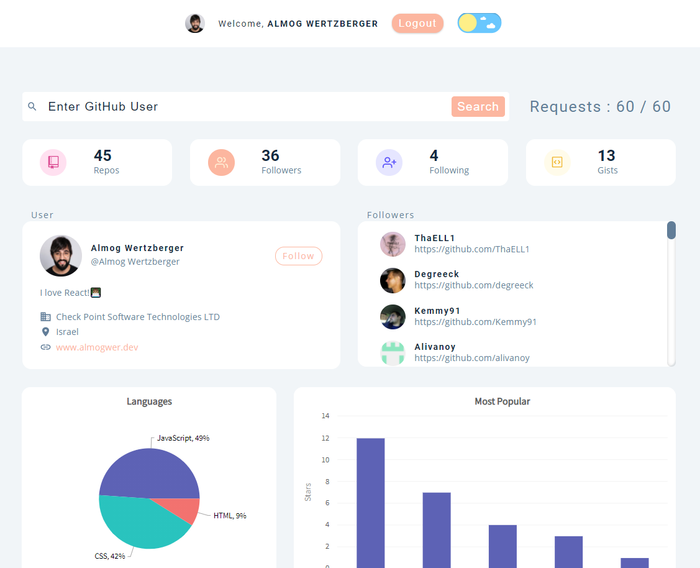
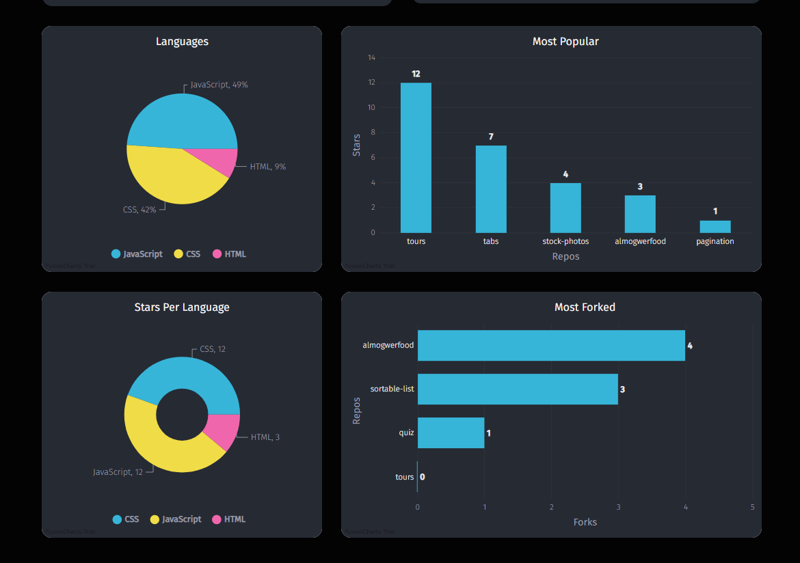

<h1 align="center">Github User dashboard</h1>

## Project Description

React project - fetching details about Github users including login with auth0 and several routes

## Built with

- HTML
- CSS
- React

# npm-start

[npm start](https://docs.npmjs.com/cli/v7/commands/npm-start)

```
npm install
```

```
npm-start -g

```

## Links

- [Repo](https://github.com/AlmogWer/quiz "Github user dashboard Repo")
- [Live](https://almogwer-github-user-dashboard.netlify.app/ "Live View")
- Dummy user
```
dummy@user.com
Aadummyuser!
```

## Screenshots & Animation





## Author

- [Almogwer](https://github.com/almogwer)
- [Mail](mailto:Almogish@gmail.com?Subject=Hi% "Hi!")
- [Linkedin](https://www.linkedin.com/in/almogwertzberger/)

## Styled Components

[Styled-Components - Main Docs](https://styled-components.com/)

```jsx
import styled from "styled-components";

const ReactComponent = () => {
 return <Wrapper>
 {some content}
 </Wrapper>
}


const Wrapper = styled.htmlElement`
write your styles here
`
export default ReactComponent
```

## React Icons

[React Icons - Main Docs](https://react-icons.github.io/react-icons/)

```jsx
import { FiUsers, FiUserPlus } from "react-icons/fi";
<FiUsers className="nameOfTheClass"> </FiUsers>;
```

## React Router Dom

version used - "react-router-dom": "^5.2.0",

- [react-router-dom - Main Docs](https://reactrouter.com/web/guides/quick-start)

- <Switch> renders the first child <Route> that matches
- A <Route path="*"> always matches

## Gihthub API

- [Root Endpoint](https://api.github.com)
- [Get User](https://api.github.com/users/almogwer)
- [Repos](https://api.github.com/users/almogwer/repos?per_page=100)
- [Followers](https://api.github.com/users/almogwer/followers)
- [Rate Limit](https://api.github.com/rate_limit)

## Fusion Charts

- [Fusion Charts - Main Docs](https://www.fusioncharts.com/)
- [First React Chart](https://www.fusioncharts.com/dev/getting-started/react/your-first-chart-using-react)
- [List Of Charts](https://www.fusioncharts.com/dev/chart-guide/list-of-charts)
- [Themes](https://www.fusioncharts.com/dev/themes/introduction-to-themes)

## Auth0

- [Auth0 - Main Docs](https://auth0.com/)
- [React SDK Docs](https://auth0.com/docs/libraries/auth0-react)
- [REACT SDK API Docs](https://auth0.github.io/auth0-react/)

## Deployment

[Netlify](https://www.netlify.com/)
